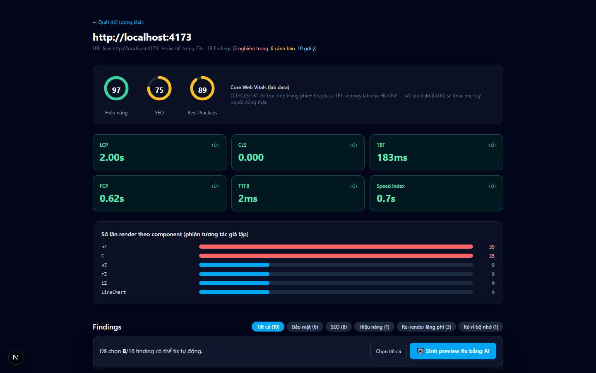
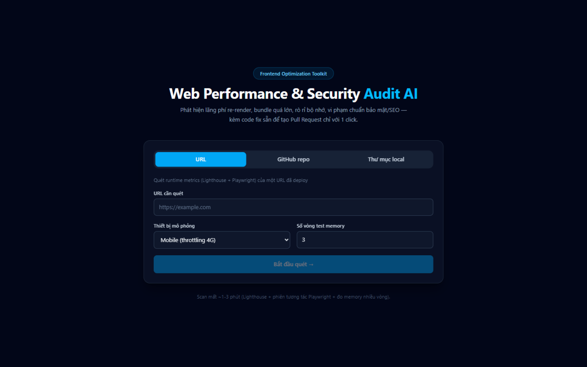
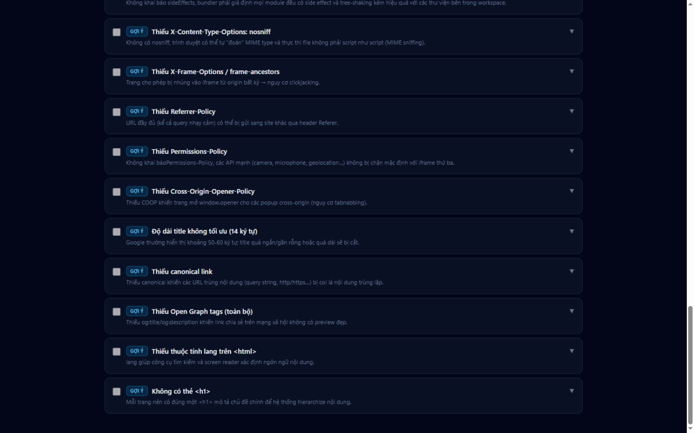

**English** | [Tiếng Việt](README.vi.md)

<div align="center">

# WPSA — Web Performance & Security Audit AI

**Scan a URL, a GitHub repo, or a local folder → detect wasteful re-renders, oversized bundles, memory leaks, and security & SEO violations → AI-generated fixes → a one-click Pull Request.**

[](https://nodejs.org)
[](https://pnpm.io)
[](https://www.typescriptlang.org)
[](https://nextjs.org)
[](https://react.dev)
[](https://developer.chrome.com/docs/lighthouse)
[](https://playwright.dev)
[](LICENSE)



</div>

---

## Table of contents

- [Why this project exists](#why-this-project-exists)
- [Features](#features)
- [Detection categories](#detection-categories)
- [Architecture](#architecture)
- [Requirements](#requirements)
- [Installation and quick start](#installation-and-quick-start)
- [Demo with an intentionally broken fixture](#demo-with-an-intentionally-broken-fixture)
- [Three scan modes](#three-scan-modes)
- [AI configuration](#ai-configuration)
- [One-click fix flow (creating a Pull Request)](#one-click-fix-flow-creating-a-pull-request)
- [Copy-prompt fix flow (bring your own AI)](#copy-prompt-fix-flow-bring-your-own-ai)
- [API](#api)
- [Testing](#testing)
- [Troubleshooting](#troubleshooting)
- [Roadmap](#roadmap)
- [Contributing](#contributing)
- [License](#license)
- [Acknowledgments](#acknowledgments)

## Why this project exists

Existing frontend auditing tools (Lighthouse, bundle analyzers…) only *point out* problems — fixing them is entirely on you. WPSA goes one step further: it **generates code fixes for each finding and opens a Pull Request that is ready to merge**.

Paste a URL, a GitHub repo, or point to a local source folder — WPSA runs Lighthouse for Core Web Vitals, uses Playwright probes for re-renders and memory leaks, statically analyzes your bundle, checks security headers and SEO, then the dashboard shows every finding with an AI-generated fix (select findings, review the diff, click Create PR).

## Features

- 🔍 **Three scan modes** — a direct URL, a GitHub repo (tarball download, private repo support), or a local source folder (with a built-in folder picker, no path typing required).
- ⚡ **Real runtime auditing** — Lighthouse 13 on the system Chrome (mobile 4G throttling / desktop), full Core Web Vitals: LCP, CLS, TBT, FCP, TTFB, Speed Index.
- 🔁 **Wasteful re-render detection** — a React DevTools hook shim through Playwright, per-component render counting, catches even **render loops that fire while the page is idle**.
- 🧠 **Memory leak detection** — DOM Nodes / JSEventListeners / Heap via CDP across multiple interaction rounds with forced GC in between; monotonic growth = leak.
- 📦 **Static bundle analysis** — parses Vite/Webpack/Next configs, detects whole-library imports (lodash, moment…), heavy libraries that aren't lazy-loaded, barrel files; measures gzip sizes in `dist/`.
- 🔐 **Security headers + SEO** — CSP, HSTS, X-Frame-Options, nosniff, Referrer/Permissions-Policy, COOP; title/description/viewport/canonical/OG/lang/h1/img-alt + robots.txt.
- 🤖 **AI-generated fixes** — any **OpenAI-compatible** endpoint works: GLM, OpenAI, DeepSeek, local Ollama… Produces fix plans as full files + reviewable diffs.
- 🚀 **One-click Pull Request** — creates a branch, commits every selected fix, opens a PR with a summary via the GitHub REST API. Sign in with GitHub (OAuth) instead of pasting a PAT — access tokens live only in server RAM, never on disk.
- 📋 **Copy-prompt fix** — available for **every scan mode** (URL, GitHub repo, local folder): generates a ready-to-paste prompt describing the selected findings so you can fix the issues with your own AI tool (Claude Code, Cursor, Copilot…) right in your working copy. Repo/folder scans also attach the related source files. Works with **no AI key configured**.
- 🇻🇳 **Vietnamese dashboard** — dark theme, stage-by-stage scan progress, reports with score gauges, color-thresholded CWV cards, and render/component charts.

<details>
<summary><b>Dashboard screenshots</b></summary>

| Home page | Findings with severity badges |
|---|---|
|  |  |

</details>

## Detection categories

| Category | How it's measured | Example fix |
|------|---------|---------|
| **Bundle size** | Parses vite/webpack/next configs, scans imports (whole-library lodash/moment, heavy libraries not lazy-loaded), barrel files, `sideEffects`; measures files in `dist/` (gzip) | manualChunks, dynamic imports, subpath imports |
| **Wasteful re-renders** | Shims `__REACT_DEVTOOLS_GLOBAL_HOOK__` before app code, counts fiber `PerformedWork` across simulated interaction rounds + an idle phase (catches render loops) | `React.memo`, `useMemo`/`useCallback`, fixing `useEffect` deps |
| **Memory leaks** | CDP `Performance.getMetrics` (Nodes, JSEventListeners, Documents, Heap) across 3–6 interaction rounds with forced GC in between — monotonic growth = leak | `removeEventListener` in cleanup, cancelling timers/subscriptions |
| **Security/SEO** | Headers: CSP, HSTS, X-Frame-Options, nosniff, Referrer/Permissions-Policy, COOP. HTML: title/description/viewport/canonical/OG/lang/h1/img-alt + robots.txt | Add headers, add meta tags |

> ℹ️ Lighthouse measures **TBT** as a lab proxy for FID/INP (FID is a field metric and can't be measured in headless).

## Architecture

A pnpm monorepo, TypeScript throughout.

```
├── packages/engine/        @wpsa/engine — standalone scanning engine
│   ├── detectors/
│   │   ├── lighthouse-detector.ts   Lighthouse 13 (system Chrome): CWV, perf/SEO/best-practices
│   │   ├── rerender-detector.ts     React DevTools hook via Playwright: per-component render counts
│   │   ├── memory-detector.ts       CDP metrics + forced GC across rounds: leak detection
│   │   ├── security-detector.ts     Security headers (CSP/HSTS/...) + SEO meta from HTML
│   │   └── bundle-detector.ts       Static analysis: build config, heavy imports, barrels, dist/
│   ├── ai/                  OpenAI-compatible client + fix plan generation (full files + diffs)
│   ├── github/              Branch → commit → PR via the GitHub REST API (octokit)
│   └── scanners/            runScan orchestrator + repo fetching (tarball API ≤ 200MB / local path)
├── apps/web/               Next.js 15 dashboard (App Router, React 19, Tailwind 4)
│   ├── app/page.tsx                 Scan form with 3 tabs: URL | GitHub repo | local folder
│   ├── app/scan/[id]/page.tsx       Report: gauges, CWV, charts, findings, diff view
│   ├── components/FolderPickerDialog.tsx  Folder browser dialog for local mode
│   ├── lib/job-store.ts             SQLite-backed job store (history survives restarts)
│   ├── lib/github-session.ts        GitHub OAuth sessions (access token in RAM only)
│   └── API routes:
│       ├── POST /api/scans                    Create a scan job (runs in background)
│       ├── GET  /api/scans                    Recent scan history
│       ├── GET  /api/scans/[id]               Status + report (poll ~1.5s)
│       ├── POST /api/scans/[id]/fix-preview   AI-generate a fix preview (with diffs)
│       ├── POST /api/scans/[id]/fix-prompt    Build a copy-ready fix prompt for your own AI tool (every scan mode)
│       ├── POST /api/scans/[id]/pull-request  Create a PR from the selected fixes (OAuth session or PAT)
│       ├── GET  /api/auth/github/start        OAuth sign-in: redirect to GitHub
│       ├── GET  /api/auth/github/callback     OAuth callback: code → token (RAM session)
│       ├── POST /api/auth/github/logout       End the GitHub session
│       ├── GET  /api/auth/session             Sign-in state for the UI (never returns the token)
│       └── GET  /api/fs                       List drives/folders for the FolderPicker
└── examples/leaky-app/     Vite+React app with intentional issues (demo + E2E tests)
```

## Requirements

| Component | Requirement |
|---|---|
| Node.js | ≥ 22.13 (`node:sqlite` built-in stores the scan history) |
| pnpm | ≥ 9 |
| Browser | Chrome or Edge installed (Lighthouse uses the system Chrome, no bundled download) |
| OS | Developed and tested on Windows 10; the engine is pure Node, so macOS/Linux work too |

On first run, Playwright needs its browser cache — if it's missing:

```bash
pnpm --filter @wpsa/engine exec playwright install chromium
```

## Installation and quick start

```bash
git clone https://github.com/<your-username>/WebPerformance_SecurityAuditAI.git
cd WebPerformance_SecurityAuditAI

pnpm install
pnpm build          # build @wpsa/engine + apps/web
pnpm dev            # web app at http://localhost:3000
```

Open [http://localhost:3000](http://localhost:3000), pick one of the three scan tabs and hit **Start scan**. Runtime scans take about 1–3 minutes depending on the target; progress is shown stage by stage.

### Optional: sign in with GitHub (OAuth)

Scan private repos and open PRs without pasting a PAT. One-time setup:

1. Go to [github.com/settings/developers](https://github.com/settings/developers) → **New OAuth App**
2. Homepage URL: `http://localhost:3000` — Authorization callback URL: `http://localhost:3000/api/auth/github/callback`
3. Copy the Client ID / Client Secret into `.env` at the repo root:
   ```env
   GITHUB_CLIENT_ID=...
   GITHUB_CLIENT_SECRET=...
   ```
4. Restart the app, then click **Đăng nhập với GitHub** at the top of the dashboard.

The access token lives only in server memory for 8 hours (or until the server restarts) and is never written to disk or the database. Without this config, the manual PAT input still works exactly as before.

## Demo with an intentionally broken fixture

The repo ships with `examples/leaky-app` — a Vite + React app that **intentionally contains every class of issue** (whole-library lodash/moment imports, a barrel file, listeners that are never removed, a state-update loop…) so you can see WPSA in action without an external target:

```bash
pnpm fixture:build && pnpm fixture:preview   # serves at http://localhost:4173
```

On the dashboard, pick the **Local folder** tab (or click **Choose folder…** to browse there):

- Path: `<repo-folder>/examples/leaky-app`
- Live URL: `http://localhost:4173` — with a live URL, the runtime audit runs too (Lighthouse + re-renders + memory)

Reference results (E2E-verified, ~25 seconds): a Lighthouse score + CWV, a **critical render loop (+22 renders while idle)**, a critical memory leak, ~7 bundle findings and ~14 security/SEO findings.

## Three scan modes

| Mode | Input | Static analysis | Runtime (Lighthouse + re-renders + memory) |
|---|---|---|---|
| **URL** | Any URL | Security headers + SEO | ✅ |
| **GitHub repo** | `https://github.com/owner/repo[/tree/branch]` (downloads a tarball ≤ 200MB; private repos need a GitHub sign-in or a token) | ✅ | Only with an extra `liveUrl` |
| **Local folder** | Absolute path (or picked via the dialog) | ✅ | Only with an extra `liveUrl` |

Shared parameters: `formFactor` (`mobile` default / `desktop`), `memoryRounds` (3–6, default 3).

## AI configuration

Copy `.env.example` → `.env` at the repo root and fill in the key:

```env
AI_BASE_URL=https://open.bigmodel.cn/api/paas/v4   # GLM; switch to api.openai.com/v1, DeepSeek, Ollama...
AI_API_KEY=...
AI_MODEL=glm-4.6
PORT=3000

# Optional — job store:
#WPSA_DB_PATH=D:\path\to\wpsa-jobs.db   # default: apps/web/.data/wpsa-jobs.db
#WPSA_JOB_TTL_HOURS=6                   # hours to keep finished jobs (default 6)
```

Any **OpenAI-compatible** endpoint (`/chat/completions` + Bearer key) works.

> **No AI key?** Scanning still works 100% — only "generate AI fixes" and "create PR" are disabled.

## One-click fix flow (creating a Pull Request)

1. Scan finishes → the report shows CWV, Lighthouse scores, the render/component chart, findings by category.
2. Tick the findings you want fixed (critical + warning are preselected) → **🤖 Generate AI fix preview**.
3. Review the per-file diffs, deselect anything you don't want.
4. **Create Pull Request** → enter the repo (`owner/name`) → the tool uses your GitHub sign-in (OAuth) or a pasted **GitHub PAT** → it creates a `wpsa/audit-fix-YYYYMMDD` branch, one commit with all fixes, and opens a PR with a summary.
5. Review the diff on GitHub → merge.

Required PAT permissions:

| Token type | Permissions |
|---|---|
| **Fine-grained** (recommended) | *Contents: Read and write* + *Pull requests: Read and write*; the repo must be in *Repository access* |
| Classic | the `repo` scope |

🔒 OAuth access tokens live only in server RAM (8h, gone on restart); a pasted PAT lives for exactly one request. Neither is ever written to any file, log, or database.

## Copy-prompt fix flow (bring your own AI)

Prefer to fix things in your own working copy with an agentic AI (Claude Code, Cursor, Copilot…)? Every scan mode offers a parallel flow:

1. Scan finishes → tick the findings you want fixed (critical + warning are preselected; every finding has a checkbox).
2. In the bottom panel click **📋 Create prompt to copy** — the tool builds a Vietnamese markdown prompt describing every selected finding (severity, category, detector, file `path:line` + snippet when known, impact, fix hint, metrics, CWV scores) and, for repo/folder scans, attaches the current content of the related source files (max 10 files × 350 lines, read from the scanned source).
3. Repo/folder scans only: untick **Kèm nội dung file nguồn** if your AI can read the repo itself (e.g. Claude Code / Cursor) — the prompt then only references paths, keeping it short.
4. **Copy prompt** → paste it into your AI tool opened at your project folder and let it apply the fixes.

For **URL scans** there is no source to attach: the prompt describes the runtime findings (security headers, SEO, CWV, render loops…) and instructs your AI to investigate your codebase and fix each issue at its root.

This flow needs **no `AI_API_KEY`** — prompt building is plain templating + file reading, so it also works when the server-side AI is unconfigured.

## API

| Method | Endpoint | Description |
|---|---|---|
| `POST` | `/api/scans` | Create a scan job (runs in background) |
| `GET` | `/api/scans` | Recent scan history (last 20 jobs) |
| `GET` | `/api/scans/[id]` | Status + report (poll ~1.5s) |
| `POST` | `/api/scans/[id]/fix-preview` | AI-generate a fix preview with diffs (requires an AI key) |
| `POST` | `/api/scans/[id]/fix-prompt` | Build a copy-ready fix prompt for your own AI tool — every scan mode (repo/folder scans can attach source files) |
| `POST` | `/api/scans/[id]/pull-request` | Create a PR from the selected fixes (OAuth session or PAT in body) |
| `GET` | `/api/auth/github/start` | OAuth sign-in: redirect to GitHub's authorize page |
| `GET` | `/api/auth/github/callback` | OAuth callback: exchange `code` → token, create RAM session |
| `POST` | `/api/auth/github/logout` | End the GitHub session |
| `GET` | `/api/auth/session` | Sign-in state for the UI (`{ configured, authenticated, login, avatarUrl }` — never the token) |
| `GET` | `/api/fs?path=` | List drives/folders (used by the FolderPicker) |

```bash
# Scan a URL
curl -X POST localhost:3000/api/scans -H 'content-type: application/json' \
  -d '{"mode":"url","url":"https://example.com","formFactor":"mobile","memoryRounds":3}'

# Scan a GitHub repo (+ optional live URL)
curl -X POST localhost:3000/api/scans -H 'content-type: application/json' \
  -d '{"mode":"repo","repoUrl":"https://github.com/owner/repo","liveUrl":"https://deploy.vercel.app"}'

# Scan a local folder
curl -X POST localhost:3000/api/scans -H 'content-type: application/json' \
  -d '{"mode":"local","localPath":"D:/projects/my-app"}'

# Poll status / fetch the report
curl localhost:3000/api/scans/<id>

# Generate a fix preview (requires an AI key)
curl -X POST localhost:3000/api/scans/<id>/fix-preview -H 'content-type: application/json' -d '{}'

# Build a copy-ready fix prompt (no AI key needed; "includeFiles":false for a short prompt)
curl -X POST localhost:3000/api/scans/<id>/fix-prompt -H 'content-type: application/json' \
  -d '{"findingIds":["<finding-id>"],"includeFiles":true}'

# Create a PR
curl -X POST localhost:3000/api/scans/<id>/pull-request \
  -H 'content-type: application/json' \
  -d '{"repo":"owner/repo","token":"github_pat_...","findingIds":["<finding-id>"]}'
```

## Testing

```bash
pnpm test           # vitest: security/SEO + bundle detectors + prompt builder + OAuth session (23 engine + 24 web tests)
pnpm build          # typecheck the whole workspace
```

E2E verified: scanning `examples/leaky-app` (local + live) catches all 4 issue groups — a render loop `(+22 renders while idle)`, a critical memory leak, 7 bundle findings, 14 security/SEO findings — in ~23s.

## Troubleshooting

| Symptom | Cause & fix |
|---|---|
| Lighthouse doesn't run | Chrome/Edge must be installed — the engine uses the system Chrome via `chrome-launcher` and never downloads its own browser. |
| Playwright reports a missing browser | Run `pnpm --filter @wpsa/engine exec playwright install chromium`. |
| Creating a PR returns **404 Not Found** | Two common causes: (1) the base branch is mistyped / doesn't exist; (2) a fine-grained PAT missing *Contents* or *Pull requests* read/write, or the repo not in *Repository access* — GitHub returns 404 instead of 403. |
| Downloading a repo fails to extract | The tarball exceeds the 200MB limit, or the repo URL is malformed. |
| Component names in the chart are minified (`nZ`, `C`) | The target is a **production build** — React strips function names in prod. Scanning a dev build gives full names. |
| Scan history is gone / an old job errors with "Server đã restart giữa chừng scan" | Jobs are stored in SQLite (`apps/web/.data/wpsa-jobs.db`) and survive restarts — jobs that were still running when the server stopped are marked as errored. Finished jobs are pruned after 6h (tune via `WPSA_JOB_TTL_HOURS`). |
| The AI fix button doesn't appear | `AI_API_KEY` isn't set in `.env` — restart the app after adding it. |
| The "Đăng nhập với GitHub" button doesn't appear | `GITHUB_CLIENT_ID`/`GITHUB_CLIENT_SECRET` aren't set in `.env` — restart the app after adding them. |
| GitHub sign-in fails with "Đổi authorization code thất bại" | Wrong Client Secret, or the registered callback URL doesn't match the actual one (`http://localhost:3000/api/auth/github/callback` — custom port? set `WPSA_PUBLIC_URL` in `.env`). |
| PR creation returns **401** after OAuth sign-in | The session token was revoked on GitHub or the session expired (8h / server restarted) — sign in again. |

## Roadmap

- [x] Persist jobs to SQLite instead of in-memory (keep history across restarts)
- [x] GitHub App / OAuth instead of pasting a PAT (OAuth App sign-in; access token kept in server RAM only)
- [ ] One-command Docker image
- [ ] Standalone CLI (scan without the dashboard)
- [ ] PDF/HTML report export
- [ ] Re-render detector for Vue/Svelte (React only today)
- [ ] CI integration (GitHub Action) auditing every PR automatically

## Contributing

All contributions are welcome!

1. Fork the repo and create a branch from `main`: `git checkout -b feat/your-feature`
2. Install dependencies: `pnpm install`
3. Write code, then make sure everything passes: `pnpm build && pnpm test`
4. Commit following [Conventional Commits](https://www.conventionalcommits.org) (`feat:`, `fix:`, `docs:`, …)
5. Open a Pull Request describing the change and how to test it

## License

[MIT](LICENSE) © 2026 WPSA contributors

## Acknowledgments

This project stands on the shoulders of these great libraries:

- [Lighthouse](https://github.com/GoogleChrome/lighthouse) — performance & CWV audits
- [Playwright](https://playwright.dev) — browser automation for the re-render/memory probes
- [Octokit](https://github.com/octokit/octokit.js) — GitHub REST for the PR flow
- [Next.js](https://nextjs.org) / [React](https://react.dev) / [Tailwind CSS](https://tailwindcss.com) — the dashboard
- [GLM](https://open.bigmodel.cn) — the default AI model for fix generation
